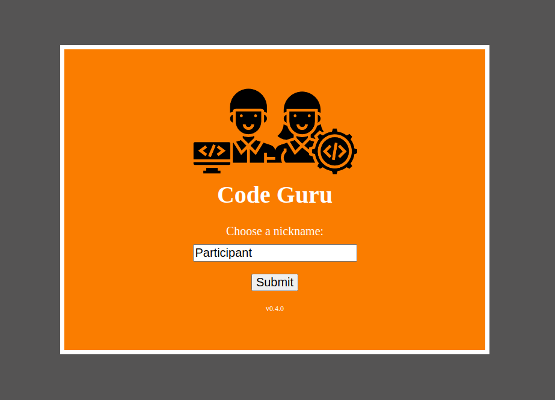
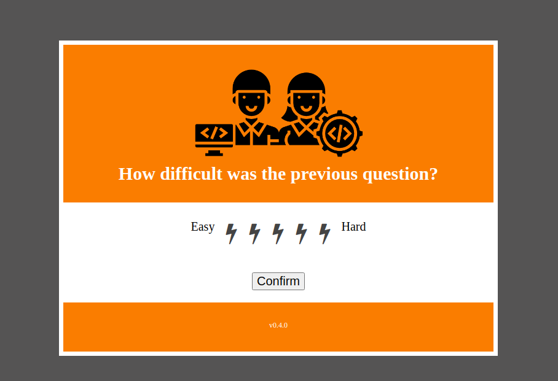
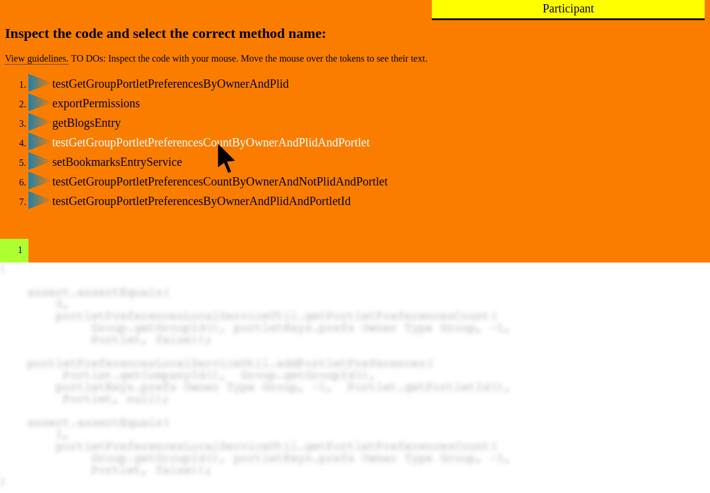
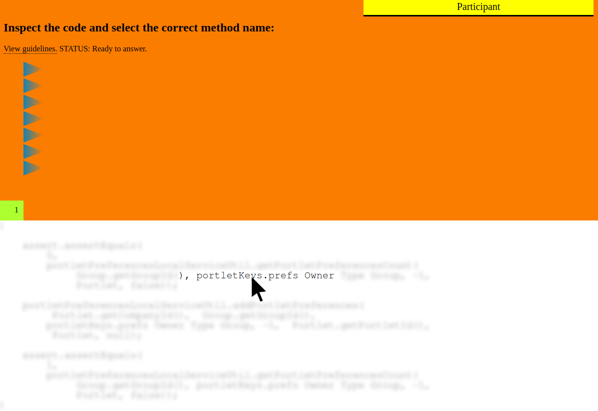
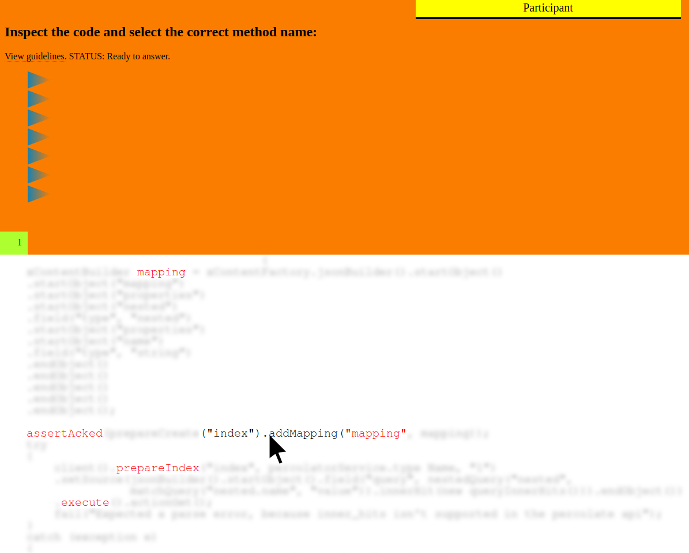

# Instructions how to install the Software artifacts

# Setup for Data Collection

The system to collect human attention relies on three component:
- the **web interface** of the *Human Reasoning Recorder* (written in NodeJS) that show the 20 method naming tasks to the participants. This interface is hosted on the free application instance from [Heroku](https://www.heroku.com/pricing)).
- the **database** containing the actual collected data and the info on which experiment set has been delivered to the user (hosted on a free instance of [MongoDB Cloud](https://www.mongodb.com/pricing))
- (OPTIONAL) the **Amazon Mechanical Turk** for [requester account](https://www.heroku.com/pricing). Here we recruit participants and validate those that send us a valid submission. <ins>Note that this is the only part that needs investment, so we invest money only on real data not on infrastructure maintenance since we use free resources.</ins>.

# Human Reasoning Recorder Deployment

To deploy this tool for a software engineering experiment you need:
- an Heroku account (FREE)
- a mongodb account (FREE)

Heroku will host our application, whereas MongoDB will host our NoSql Database to store the logs of the participants.

## Clone the repository
Clone this repository in your local machine:
```bash
git clone https://github.com/...
```

## Install Heroku CLI
Follow these steps:
1. Create heroku account on heroku.com
1. Download and install **Heroku CLI** (google it and download)

Go to the folder where you cloned the project and open the CLI there:
1. create an ssh key (https://devcenter.heroku.com/articles/keys)
    ```code
    ssh-keygen -t rsa
    ```
1. add key to heroku account. In this project CLI:
    ```code
    heroku keys:add
    ```
1. Create the link between this git and the heroku remote. In this project CLI:
    ```code
    heroku create <app_name_you_want_it_to_be>
    ```
1. Add a new heroku remote. In this project CLI:
    ```code
    git remote add heroku https://git.heroku.com/<app_name_you_want_it_to_be>.git
    ```

## Create a MongoDB Database
1. Create an account on cloud.mongodb.com
1. Create a new project via website. Let's name it: `MyProject`.
1. Open the project and create a cluster. Choose the FREE options with 512 MB of storage space.
1. Go to the `security section > database access` and **Add new database user**
1. Select a user name and password, then add user
1. Go to `security section > network access` and **Add IP address** and allow from everywhere (since we do not know where heroku will deploy our app precisely), then confirm.
1. Go to `data storage section > clusters` and click on **Connect** in your `MyProject` cluster.
1. Select **Connect your application**
1. Copy the url endpoint

## Connect Heroku and MongoDB
Our NodeJS web interface, hosted on Heroku, needs the credentials we just created to store new documents (participants logs) in the database:
1. Create a copy of the configuration file at `config/template.settings.yaml`, rename it to `config/settings.yaml`
1. Insert the username and password from mongodb, replacing `<your_username>` and `<your_password>`.
1. Insert the url endpoint, replacing `<your_endpoint>`.
1. Save and **commit** your changes locally
1. Push it to heroku. In this project CLI:
```code
git push heroku master
```
**Troubleshooting**:
Sometimes you might need to force the push:
```code
git push heroku master --force
```

## Install MongoExport CLI Tool
We need `mongoexport` to efficiently download data from mondodb. Follow the official documentation for that: https://docs.mongodb.com/database-tools/mongoexport/


## Publish experiments
If you used the default configuration, the JSON files in the folder `data/datasets/methods_showed_to_original_participants` have been already deployed to the heroku nodejs app, nevertheless the information on whether each expeirment dataset has been already consumed by a participant or not, that is stored in the mongodb database.
In this step, we add records to the mongodb database to let it know that heroku has new experiment sets to show to participants.


Open and run the following notebook: `notebooks/Uplaod_Available_Experiment_Sets.ipynb`.


# Open the interface
If everything was successful, you can access your *Human Reasoning Recorder* interface directly from any computer!
To get the url get the name of the application with:
```bash
heroku apps
=== <YOUR_EMAIL> Apps
<YOUR_APP_NAME>
```
And then go to `<YOUR_APP_NAME>.herokuapp.com` to see your *Human Reasoning Recorder*! Congratulations!

# Interface Walkthrough

A demo of the environment is available here (the tool starts on demand, so it might take up to 30 seconds to start if you are the first user of the day):

[Try the Human Reasoning Recorder NOW!](https://demo-thinking-like-a-developer.herokuapp.com/)

## 1. Intro Page
Startup intro page:




## 2. Guideline before
Before asking we inform the participant about the task:



## 3. Main Task: Method Naming
3.1 Interface to explore the method body and choose one of the alternatives:



3.2 Deblurring based code exploration:



3.3 Click on tokens to make them always visible:




## 4. Question on Perceived Difficulty
We ask "How difficult was the previous question?" right after every method inspection.


# What's in for ME as a Researcher?

Remember that the platform is fully customizable: the task can be changed according to your needs, it takes only a simple JSON file as input where you:
- ask your code related question
- propose your custom list of options
- provide a code snippet (and the tokenization that you want)
- provide a custom after task question with a grading scale

The platform will record the answers of the user together with all the events with a timestamp (e.g. mouse over token, clicked tokens, mouse over alternative) to let you perform your custom analysis and answer your research questions.

Now that you had a look at the interface, why not to try the experience by yourself?
[Try the Human Reasoning Recorder NOW!](https://demo-thinking-like-a-developer.herokuapp.com/)