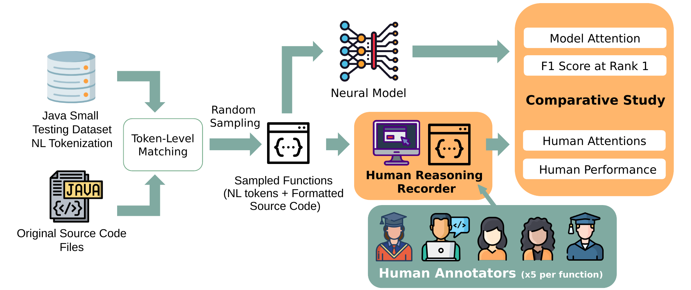

# Thinking Like a Developer

Related research publication:
"Thinking Like a Developer? Comparing the Attention of Humans with Neural Models of Code", *conditionally accepted at ASE '21*, Matteo Paltenghi, Michael Pradel

## Reproducibility Levels and Target Audience
This publication involves two levels of reproducibility:
1. **Comparative Study: Neural Models versus Human Attention**: we compare the attention weights of two neural models with the collected human data. At this level, you can use the preprocessed human attention data from participants and the precomputed models' attention weights and re-create the figures of the paper.

    **Target Audience:** <u>researchers/practitioners developing a new Software Analytics approach</u>:
    You can benchmark your approach form an explainability perspective by analyzing whether the explainability metric of your model (e.g. attention weights or feature importance) is correlated to our human attention dataset. This could help you highlight strengths and weaknesses of your neural model.

1. **Empirical Study**: we collect data on how humans inspect source code while performing the method naming task via the *Human Reasoning Recorder* (HRR) interface. At this deeper level, we explain you how to set up the *Human Reasoning Recorder* interface, prepare the methods to show and how to process the human logs into an attention score.

    **Target Audience:** <u>Software Engineering researchers performing a user study with developers</u>:

    You can use our *Human Reasoning Recorder* web interface to submit a series of task to a crowd of participants (remote participation allowed, such as Amazon Mechanical Turk) and collect the results on how developers perform the task. The web environment lets the participants inspect only code under the mouse pointer such that the mouse trace can approximate the attention of the human, in a similar way to use of fixation time in expensive eye tracking experiments.

## 1. Comparative Study: Neural Models versus Human Attention

To reproduce this study, prepare the environment as explained in the [INSTALL.md](INSTALL.md) file, then perform the following operations.
1. download the data and place the unzipped content in the `data` folder of this repo: https://doi.org/10.6084/m9.figshare.14462052
1. given that your environment as explained in the [INSTALL.md](INSTALL.md) is up and running, open the notebook [Comparative_Study.ipynb](notebooks/Comparative_Study.ipynb) in your Jupyter browser interface and run it cell by cell top to bottom to recompute the paper results and recreate also the figures (available [here](notebooks/paper_figures)).

### More Reproducibility
If you want to reproduce also the extraction of attention weights from the two neural models we share also the code we reuse from the original work plus our modifications. Follow the instruction contained in the `README_NEW_STUDY.md` files of the following two sub-repositories:
1. Neural Model 1 (Convolutional-based). [See guidelines in dedicated sub-repository](https://github.com/MattePalte/convolutional-attention_ATTENTION_STUDY/blob/master/README_NEW_STUDY.md)
1. Neural Model 2 (Transformer-based). [See guidelines in dedicated sub-repository](https://github.com/MattePalte/NeuralCodeSum_ATTENTION_STUDY/blob/master/README_NEW_STUDY.md)

For completeness we also provide you with our trained models:
1. Model 1 (Convolutional-based): https://doi.org/10.6084/m9.figshare.14414672
1. Model 2 (Transformer-based): https://doi.org/10.6084/m9.figshare.14431439

You can see our output predictions of the model as raw data here: https://doi.org/10.6084/m9.figshare.14452590.
Then to get the processed version of the model predictions in a way they are suitable for the comparative study you can use the given [python script](scripts/process_raw_human_logs.py) to preprocess raw data using respectively the functions `praparetransformer` and `prapareextsummarizer`. Follow the given the relative [instructions](scripts/README.md).

## 2. Empirical Study

To reproduce this empirical study or to deploy and run the *Human Reasoning Recorder* on your machine follow this work flow. Each step provides input data from the previous step, instruction to perform the that step in form of Jupyter notebooks of scripts, and output data.
1. **Dataset with precomputed experiment sets**: we group the methods to be shown to a single participants in a single JSON file. The dataset contains multiple of these JSON files (and is available directly [here](data/datasets/methods_showed_to_original_participants)). It is built in such a way that the same method is proposed to 5 different users. Note that in our survey we did not deliver all the available experiment sets, but only the first part.
1. **Setup the Human Reasoning Recorder (HRR)**: for the installation of the *Human Reasoning Recorder* you can follow the steps in the [INSTALL.md](INSTALL.md) file. A successful deployment and run of the experiment lets you collect raw data from human participants similarly to our data: https://doi.org/10.6084/m9.figshare.14452590.
1. **Processing of raw participants logs**: this downloads the data from the MongoDB database (connected to the HRR) and processes them. Follow the the given [python script](scripts/process_raw_human_logs.py) to download and preprocess raw data using respectively the functions `download` and `preparehuman`. You can access the raw human data of our empirical study directly [here](https://doi.org/10.6084/m9.figshare.14452590). Follow the relative [README](scripts/README.md) to learn how to use the script. This step produces as output the prepocessed human data, ready for the comparative study: https://doi.org/10.6084/m9.figshare.14462052.
1. **Filtering**: given the number of correct answers by each participant, assign it a probability of coming from a random guesser. If this probability is high it will be rejected in the comparative study part. You can reproduce this step by following [this notebook](notebooks/Filtering_Random_Guesser_Computation.ipynb).
This step produces an output csv stored at `data/user_info/users_evaluation.csv` and used in the comparative study. This step's output can be found directly here: https://doi.org/10.6084/m9.figshare.14462052.

**OPTIONAL**: If you want to create your own dataset of methods to present to the participants you read the procedure documented [here](RUN_YOUR_SURVEY.md).

---------------------

## Hardware Setup

### Comparative Study
We tested the following setup:

- Operating System: Ubuntu 20.04.2 LTS
- Kernel: Linux 5.4.0-77-generic
- Architecture: x86-64
- CPU: Intel(R) Core(TM) i7-10610U CPU @ 1.80GHz
- conda 4.10.1
- Python 3.8.10
- RAM: 32 GB

### Training of Neural Models
We tested the following setup:

- Operating System: Ubuntu 18.04.5 LTS
- Kernel: Linux 4.15.0-136-generic
- Architecture: x86-64
- CPU: Intel(R) Xeon(R) Silver 4214 CPU @ 2.20GHz
- conda 4.9.2
- RAM: 252 GB
- Python: refer to the specific sub-repository configuration: [here](https://github.com/MattePalte/convolutional-attention_ATTENTION_STUDY/blob/master/README_NEW_STUDY.md) and [here](https://github.com/MattePalte/NeuralCodeSum_ATTENTION_STUDY/blob/master/README_NEW_STUDY.md)

**GPU Setting:**

- x2 GPUs: Tesla T4 with 16 GB each
- Nvidia driver (as reported by nvidia-smi command): NVIDIA-SMI 450.102.04 - Driver Version: 450.102.04 CUDA Version: 11.0
- Nvidia drivers in folder: /usr/local/cuda-10.2