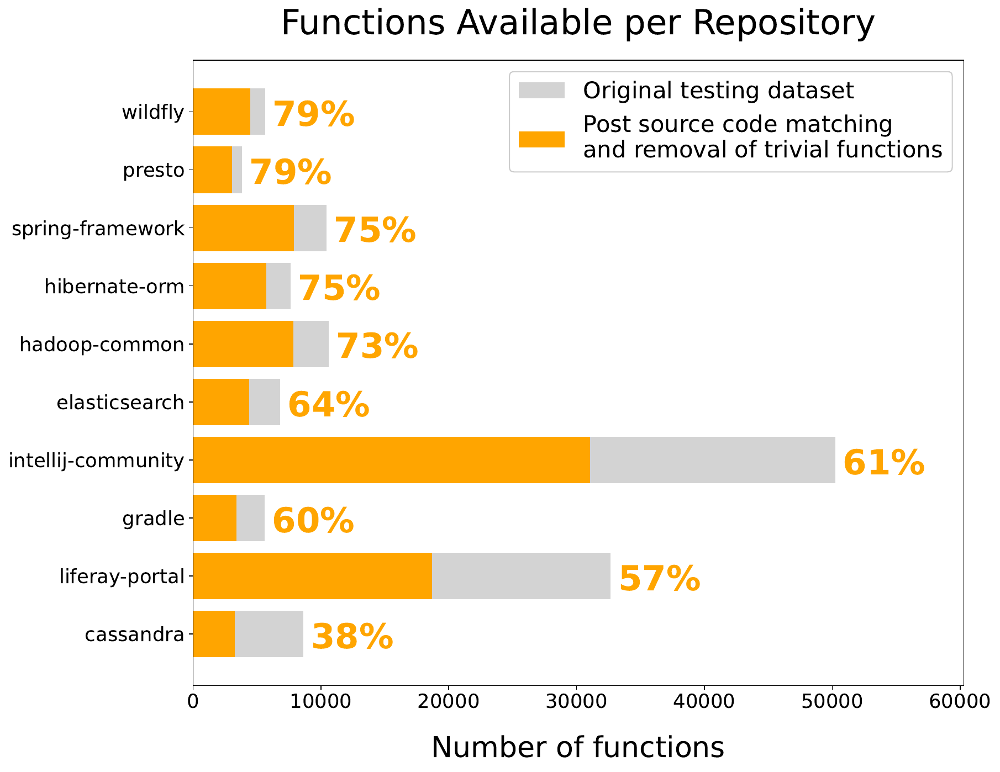

# Run your own Survey

Here we document the procedure we followed to create our experiments set in folder `data/datasets/methods_showed_to_original_participants`, follow this procedure to create your own.

The two main steps are the following:
1. **dataset with Java methods** already tokenized and its relative source code https://groups.inf.ed.ac.uk/cup/codeattention/
1. **human task preparation**: we sample some methods to present to the participants and for each method we prepare seven alternatives method name to show to the participant.

Make sure that you can access Astyle tool via command line: http://astyle.sourceforge.net/ .
For the entire pipeline follow the notebook `Preparation_of_Task_and_Experiment_Sets.ipynb` and run it end to end. **Warning**: It will be a long running operation.

If you want to use your own tokenization you have only to provide a similar JSON file for each participant as in folder `data/datasets/methods_showed_to_original_participants`. Here you can see one example where a user is proposed only with a single method.

Original function:
```java
public int getTotalSplits() {
    return totalSplits;
}
```

JSON format. Content of `experiment.json`:
```json
[{
    "cap_original_tokens": ["<SENTENCE_START>","{","return","<id>","total","Splits","<\/id>",";","}","<SENTENCE_END\/>"],
    "file_name":"QueryStats.java",
    "formatted_lines":["{","    return totalSplits;","}"],
    "function_name":"getTotalSplits",
    "function_name_tokens":["get","total","splits"],
    "id_body_hash":"2e3b44c8cee95071bd99638844cbcc87",
    "id_same_identifier_list":[0,1,2,3,3,4,5,6],
    "option_correct":"getTotalSplits",
    "options":["getTotalSplits","getSplits","getPartitionSplits","getColumnTypes","getAllSplits","copyTable","testApproximateQueryCountCustkey"],
    "options_nlp":["get total splits","get splits","get partition splits","get column types","get all splits","copy table","test approximate query count custkey"],
    "options_random":["getColumnTypes","copyTable","testApproximateQueryCountCustkey"],
    "options_tfidf":["getPartitionSplits","getSplits","getAllSplits"],
    "project_name":"presto",
    "source_code_string":"public int getTotalSplits()\n    {\n        return totalSplits;\n    }",
    "tokens_in_code":[{"index_id":0,"token_group":0,"text":"{","start_char":0,"line":0},{"index_id":1,"token_group":1,"text":"return","start_char":4,"line":1},{"index_id":2,"token_group":2,"text":"total","start_char":11,"line":1},{"index_id":3,"token_group":3,"text":"Splits","start_char":16,"line":1},{"index_id":4,"token_group":3,"text":";","start_char":22,"line":1},{"index_id":5,"token_group":4,"text":"}","start_char":0,"line":2}],
    "tokens_list":["{","return","total","Splits",";","}"],
    "uuid":"471f2eab813434908acd9d9c24988976"
}]
```

## Detail: how we prepared our dataset

We sample method for the human task starting from the testing dataset of "A Convolutional Attention Network for Extreme Summarization of Source Code". Unfortunately it contains only the parsed tokens of the methods without any spacing, but because we want to display the source code to human we need a human-readable format, therefore we match every method in the dataset with its original source code. For this we use a matching strategy that follows these steps:
1. we run JavaParser library to extract all the methods available in the original source files and tokenize their method bodies. Note that we use a lossless tokenization, in which spaces and indents are maintained. \item we format the original source code in order to fit the participant screen with a maximum line length of 80. We use [Artistic Style 3.1](http://astyle.sourceforge.net/) as Java formatter library;
1. we scan all the methods in the Allamanis tokenized dataset and from filename, method name and tokens we find a corresponding matching method in our lossless version obtained with JavaParser in the previous step. We consider a match if the lossless version contains all the characters in the Allamanis tokenization one after the other. Note that we allow extra characters to be in between two consecutive matched tokens, such as space, new line, indentation, etc. In the case an extra word (e.g. comments) is present in the lossless version but it is not present in the Allamanis tokenization we consider it as a match, though note that we always display only the Allamanis token to the participant, so participants never see code comments.
    - in case of multiple matches of a method in Allamanis testing dataset and our lossless version, we keep only those methods with the shortest length in terms of characters.

After this process we are not able to find all the matches because of the presence of some arbitrary transformation of certain characters groups in the original paper tokenization, nevertheless we reconstruct the majority of the testing dataset containing all the ten projects.

After the analysis of the testing dataset by Allamanis we notice the presence of multiple duplicate method bodies, precisely **23\%** of all the datapoints has at least a duplicate method with the same tokens in the method body . This means that the model, provided with the same input, outputs exactly the same prediction every time.

After manual inspection we realize that those methods with a large number of duplicates are also very trivial and they contain almost uninformative method bodies for both a model and a human, therefore we excluded them from the study. In particular, we remove all the methods with at least three copies in the dataset, made of at maximum one line and ten tokens (including the curly braces). The top six duplicated method are presented in Table below with their relative frequency. We drop 50 unique method bodies for a total of 5977 method bodies.


|Method Body | Occurrences |
|---|---|
|{ } | 1540 |
|{ doTest( );}|1324|
|{ return null;}|527|
|{ return false;}|527|
|{ return id;}|317|
|{ return true;}|316|


The final available methods for us to display are therefore a subset as shown in Figure below this covers a maximum of 79 \% of the original repositories methods for wildfly to a minimum of 39 \% for Cassandra.


